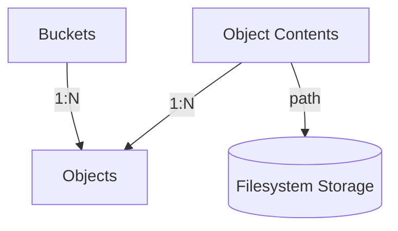

# bucket-brigade

A self-hosted, content-addressed object storage service backed by SQLite and the local filesystem.

## Data model



Three tables drive the storage model:

**`buckets`** — a named namespace for objects. Buckets are created automatically on first write; there is no explicit create-bucket API.

**`objects`** — a key within a bucket, pointing at a content record. The `(key, bucket_id)` pair is unique, so the same key can exist independently in different buckets.

**`object_contents`** — the actual content, stored once per unique `(sha256, bucket_id)` pair. Two objects in the same bucket that share identical bytes point at the same content record; objects in different buckets always get separate records. Each record carries a `ref_count` that tracks how many objects reference it.

### Filesystem layout

Object bytes live on disk under `{storage.base-path}/contents/`. Each file is named with a random temp-file suffix assigned at write time and stored in the `path` column of `object_contents`. When a content record's ref count drops to zero (That is, all the objects within a buckets that share the same content have been deleted) the backing file is deleted. A startup sweep (`CleanupZeroRefContents`) recovers any files left orphaned by a crash between the ref-count update and the file deletion.

## Architecture

The codebase is organised into three layers.

### Controllers (`api/`)

`api/v1.go` implements the HTTP handlers. Routes and request/response types are **generated from the OpenAPI spec** at `api/openapi.yaml` via [oapi-codegen](https://github.com/oapi-codegen/oapi-codegen); run `make generate` to regenerate `api/generated.go` after editing the spec. The Makefile uses the modern **`go tool`** pattern (Go 1.24+), ensuring the generator version is pinned in `go.mod` and requires no manual binary installation.

Two middleware components sit in `api/middleware/`:

- **`ValidateObjectParams`** — rejects requests where `bucket` or `objectId` exceed 255 characters or contain control characters, and enforces the configured upload size limit.
- **`ErrorHandler`** — intercepts errors attached to the gin context and writes [RFC 9457](https://www.rfc-editor.org/rfc/rfc9457) `application/problem+json` responses. All error types (`400`, `404`, `413`, `500`) are mapped here rather than scattered across handlers.

Two operational endpoints are registered directly on the router (outside the spec):

- `GET /livez` — liveness probe, always returns 200.
- `GET /readyz` — readiness probe, pings the database and returns 503 on failure.
- `GET /metrics` — Prometheus metrics endpoint.

## Observability

The project includes built-in observability through structured logging and Prometheus metrics.

### Structured Logging
Every request is logged using `logrus` with the following fields:
- `status`: HTTP status code
- `latency`: Request processing time
- `method`: HTTP method
- `path`: Request path
- `upload_size`: Size of the request body in bytes
- `download_size`: Size of the response body in bytes
- `error`: Private error messages (if any)

### Prometheus Metrics
A `/metrics` endpoint exposes the following metrics:
- `http_requests_total`: Counter of HTTP requests labeled by `method`, `endpoint`, and `status`.
- `http_request_duration_seconds`: Histogram of request latency labeled by `method` and `endpoint`.
- `http_request_size_bytes`: Histogram of request body sizes labeled by `method` and `endpoint`.
- `http_response_size_bytes`: Histogram of response body sizes labeled by `method` and `endpoint`.
- Standard Go and process metrics (CPU, memory, goroutines, etc.).

### Services (`pkg/`)

Business logic lives in three service packages:

- **`pkg/buckets`** — `GetOrCreateBucket` looks up or creates a bucket by name within the current transaction.
- **`pkg/contents`** — `GetOrCreateContent` streams the request body to a temp file, computes its SHA-256, and either returns an existing content record or creates a new one. `DecrementRefCount` / `IncrementRefCount` maintain reference counts. Post-commit cleanup (`FinalizeUnreferencedContent`) deletes files and rows once a content record is no longer referenced.
- **`pkg/objects`** — `UploadObject`, `DownloadObject`, and `DeleteObject` coordinate the bucket, content, and object repositories within a single database transaction.

All services expose a `WithTx(tx)` method so the object service can propagate a transaction across all three packages.

### Repositories (`pkg/*/repository.go`)

Each package has a repository that owns all direct database access via GORM. Repositories are injected as interfaces, making them easy to swap in tests.

### Wiring (`cmd/bucket-brigade/main.go`)

`main.go` is the composition root. It loads config, runs migrations, constructs the repository → service → handler chain in order, and starts the HTTP server. No business logic lives here.

## Configuration

Configuration is loaded from `properties.yaml` at the working directory. Every key can be overridden with an environment variable by uppercasing and replacing `.` and `-` with `_` (e.g. `SERVER_PORT=9090`).

| Key | Default | Description |
|-----|---------|-------------|
| `server.port` | `8080` | HTTP listen port |
| `server.log-level` | `info` | Logrus level (`debug`, `info`, `warn`, `error`) |
| `server.max-upload-bytes` | `5368709120` | Maximum request body size (5 GiB) |
| `server.timeouts.read` | `30s` | HTTP read timeout |
| `server.timeouts.write` | `60s` | HTTP write timeout |
| `server.timeouts.idle` | `120s` | HTTP idle timeout |
| `server.validation.object-route-param-max-length` | `255` | Max length for bucket and key path parameters |
| `database.sqlite-path` | `bucket_brigade.db` | Path to the SQLite database file |
| `database.sqlite.journal-mode` | `WAL` | SQLite journal mode |
| `database.sqlite.busy-timeout-ms` | `5000` | SQLite busy timeout in milliseconds |
| `database.migrations.path` | `db/migrations` | Path to SQL migration files |
| `storage.base-path` | `./data` | Root directory for content files |

Database migrations run automatically on startup.

## Tests

### Unit and integration tests

```
make test          # run all tests
make test-race     # run all tests with the race detector
```

Tests in `api/` spin up the full stack (real SQLite, real filesystem) in a temp directory and exercise the HTTP layer end to end.

### BDD tests (Cucumber / godog)

```
make bdd           # run Cucumber scenarios with verbose output
```

Feature files live in `bdd/features/` and cover four areas:

- **`objects.feature`** — upload, download, delete, overwrite, idempotent re-upload, cross-bucket isolation, empty body
- **`deduplication.feature`** — same-bucket deduplication, cross-bucket separation, ref-count behaviour on overwrite and delete
- **`validation.feature`** — bucket name length, key length, body size limit
- **`edge_cases.feature`** — malformed/missing path segments

Each scenario runs in full isolation with its own SQLite database and temp directory.

### Combined

```
make test-all      # unit + race + BDD
```

Combined coverage across unit and BDD tests: **~79%**.


## how AI was used in the project

### Initial project evaluation 

The prompt was dumped into ChatGPT, asking recommendation between the right balance of simplicity and sufficient detail to showcase best engineering practices. 
ChatGPT was also asked to weigh in on the requirement "The service should de-duplicate objects by buckets”, which felt a little ambiguous. ChatGPT came back with the following interpretations:

1. Deduplicate by object ID within a bucket - this option was not considered, as this is regular key semantic, with no real deduplication to speak of
2. Deduplicate by content within a bucket - this is the option that was retained. Within a bucket it is possible to have multiple objects with different keys all pointing to the same content
3. Deduplicate globally, but partitioned by bucket - Similar to option 2, but the content is shared across buckets
4. Deduplicate requests, not stored content - Treat PUT requests idempotently. This option is not likely as the prompt says "objects", not "requests"
5. Bucket itself is the dedup unit - a bucket cannot have two objects with identical content, regarless of object Ids

### Non-functional Requirements, Refactoring and code cleanup

The initial fundation was hand-coded, following a template https://medium.com/better-programming/my-favourite-setup-for-rest-microservices-in-go-770ca18615ba - This provided a rough draft of the project, with the primary focus on the object model (Bucket, Object, and Content) and proper layering of the application.

Once the foundations were working, a combination of Claude Code and Gemini CLI was used to help with polishing the code. In particular, I opted to centralize the API error handling via Gin middleware- Whereas my original code was dealing with each potential failure individually for each endpoint, Gemini refactored it into a central error handler. A quick Google search revelead that there is a library that implements RFC 9457, and Gemini was able to make the appropriate changes to incorporate it within the error handler.

The authoring of the application configuration code was delegated to Gemini/Claude, using the properties.yaml file as an example of what the configuration should look like, and integrating it with Viper to directly map configuratino properties to objects.

Claude was used to produce the Cucumber tests.

As the project was nearing completion, Codex, Claude and Gemeni were asked to perform a thorough code review. It is interesting to note that all of them found legitimate issues that needed addtressing (maximum payload size, edge case transaction failures...), none really cared about the code consistency or clarity- This took a handsome engineer to go through the code and make sure the code did not introduce any undue burden on the reviewer.

# What this project doesn't do

* As rightly mentioned by the AI agent, there is no protection behind the endpoints
* The location and name of the config file is hardcoded; it could be easily be configured either via command line arguments or environment variable
